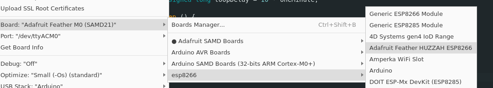
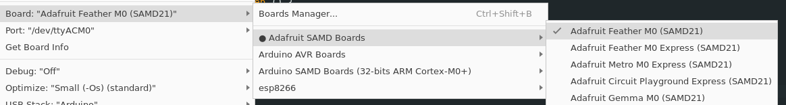

# Home tracker environmental sensors

This repository contains the Arduino code for environmental sensors I'm developing.

I have discussed this project on my blog at [statox.fr](https://www.statox.fr/posts/2024/06/environment_sensors/).

# Software architecture and setup

- The [ATWINC1500](./ATWINC1500) directory contains code for uploading to [Adafruit Feather M0 WiFi](https://www.adafruit.com/product/3010) boards
- The [ESP8266](./ESP8266) directory contains code for uploading to [Adafruit Feather Huzzah](https://www.adafruit.com/product/2821) boards

Both directories contain board-specific versions of the same code for interfacing with the network, reading the battery level, starting deep sleep mode and running the main loop.

- The [libraries](./libraries) directory holds common code used by both board-specific projects and other dependencies.
    - [Statox_Blink](./libraries/Statox_Blink) is a utility for blinking the built-in LED of the boards.
    - [Statox_Sensors](./libraries/Statox_Sensors) is my collection of wrappers around other libraries for reading various sensors ([BME280](https://whadda.com/product/bme280-temperature-humidity-and-pressure-sensor-wpse335/), [DHT11/22](https://learn.adafruit.com/dht), [SHT30](https://www.adafruit.com/product/5064), [NTC-MF52 thermistors](https://www.velleman.eu/products/view/?id=435554))
    - [Statox_Config](./libraries/Statox_Config) contains configuration header files for the sensors I'm creating. (e.g. WiFi SSID and passwords) (Only `*.sample.h` files are versioned they must be copied to their equivalent without `.sample` in their name)
    - The other directories are libraries installed via Arduino IDE. (TODO Find a better way to manage that?) I am not the author of these libraries their individual licenses should be respected.

The project is designed to be opened by Arduino IDE 2.x as a "Sketchbook"

- Opening either of the board-specific sketches should open a new instance of the IDE
- You may need to set the "Sketchbook location" setting to the root directory of this repository in "File > Preferences" in the IDE

Additionallly, you need to install the boards packages in the IDE. The process to do that is documented on the learning page of each board on the Adafruit website (see the "Resources" section).

To do this, you need to add the following URLs, seperated by commas in the "Additional boards manager URLs" setting in "File > Preferences" in the Arduino IDE:

- http://arduino.esp8266.com/stable/package_esp8266com_index.json
- https://adafruit.github.io/arduino-board-index/package_adafruit_index.json

Then use the following boards:

- Feather Huzzah: "esp8266 > Adafruit Feather HUZZAH ESP8266"
- Feather M0: "Adafruit SAMD Boards > Adafruit Feather M0 (SAMD21)"

# Principle of operations

Despite the differences of implementation between the boards, the main progams follow this logic:

- Initialize Wifi and check the connection status; if not connected, enter sleep mode and retry later.
- Initialize the sensors using the `initXXX()` from `Statox_Sensors`, if needed (for sensors using I2C for example)
- Read from the sensors using the `readXXX()` from `Statox_Sensors`. These functions should return their result as an array of `float`
- Read the battery level. The M0 has a built-in voltage divider which can be read directly from a pin. For the Huzzah, I implement the tension divider myself and tied it to a pin.
- Pass the read values to a function reponsible for creating a JSON document and posting it to the api.
- Go to deep sleep mode and repeat.

Currently, the pins used by each sensors are directly in the `Statox_Sensors` library code, and the reading of each sensor is modified in the main loop depending on which physical sensors I attach to the board. My goal is to change this and have a proper configuration system in a header file to centralize the customization of each system in a single file.

# Boards specificities

## Feather Huzzah

- The board does not support SSL well due to the lack of dedicated for encryption
- Deep sleep is provided directly by the `ESP` class from the board installation. It makes both the board and the WiFi chip sleep properly. (**Warning** The function takes microseconds as argument)
- A voltage divider is required to read the battery level, utilizing the only analog input pin of the board.
- The Wifi and HTTP client libraries are coming directly from the board setup but could likely be replaced with `WiFi101`. (TODO)

## Feather M0 Wifi

- The WiFi chip's firmware needs to be updated to match the firmware expected by the `WiFi101` library (documentation available on Adafruit's learning center)
    - **CAUTION** Ensure you use `WiFi101`'s `setPins()` function properly (done in `initWiFi()` in my code).
- The board is supposed to support SSL but might need its certificate updated. This is also documented on Adafruit. I haven't tested yet and still use plain HTTP calls (booo)
- The deep sleep feature is provided by the `ArduinoLowPower` library to put the ATSAMD21 chip to sleep, combined with a call to `WiFi.end()` from `WiFi101` to stop the ATWINC1500 chip.
# Resources

- https://randomnerdtutorials.com/esp8266-nodemcu-http-get-post-arduino/
- https://learn.adafruit.com/adafruit-feather-huzzah-esp8266
- https://learn.adafruit.com/adafruit-feather-m0-wifi-atwinc1500

## Libraries

- [ArduinoJson](https://arduinojson.org) Used in api code for GET and POST requests
- [DHT sensor library](https://github.com/adafruit/DHT-sensor-library) (Its dependency "Adafruit Unified Sensor" is automatically installed by Arduino IDE when installing the lib) Used to read from the DHT11 sensor
- [BME280 Library 3.0.0 by Tyler Glenn](https://github.com/finitespace/BME280) Used to read from the BME280 sensor. I tried used the Adafruit library for the BME280 but it doesn't work with the sensor I bought from Velleman (whadda.com). I don't know if there is compability issue between the breakout boards and libraries.

## Components

### Main board: ESP8266 [Adafruit Feather Huzzah](https://learn.adafruit.com/adafruit-feather-huzzah-esp8266)

The ESP8266 supports a deep sleep mode which allows for very low current consumption while it is not active, it can read the DHT22 on a digital pin and the BME280 via I2C.
The main drawback is that the board doesn't support SSL and HTTPS properly. In the future I'll probably want to switch to an ESP32.

### Sensor: DHT22 [Whadda Temperature and humidity sensor](https://whadda.com/product/cm2302-dht22-temperature-humidity-sensor-module-wpse345/)

Humidity: 0-100% (accuracy 2-5%)
Temperature: -40 to 80°C (accuracy 0.5°C)
Power: 3-5V
Current: 2.5mA max current use during conversion (while requesting data)
Sampling: No more than 0.5 Hz sampling rate (once every 2 seconds)

### Sensor: BME280 [Whadda Temperature, humidity and pressure sensor](https://whadda.com/product/bme280-temperature-humidity-and-pressure-sensor-wpse335/)

Humidity: 0-100% (accuracy 3%)
Temperature: -40 to 85°C (accuracy 1°C)
Pressure: Not sure about range (accuracy 1hPa)
Power: 1.71-3.6V
Current: 3.6 uA @ 1Hz for humidity, temperature and pressure reading
Sampling: 1 Hz sampling rate (once every seconds)

[Bosch datasheet](https://www.mouser.com/datasheet/2/783/BST-BME280-DS002-1509607.pdf)
